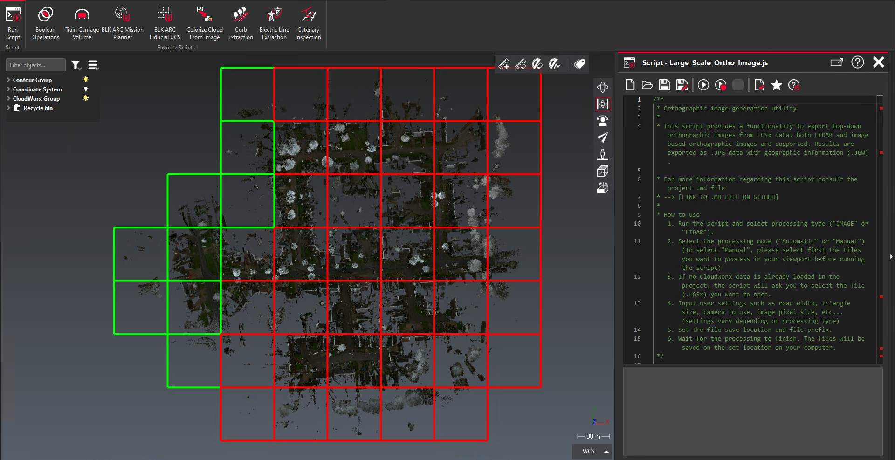
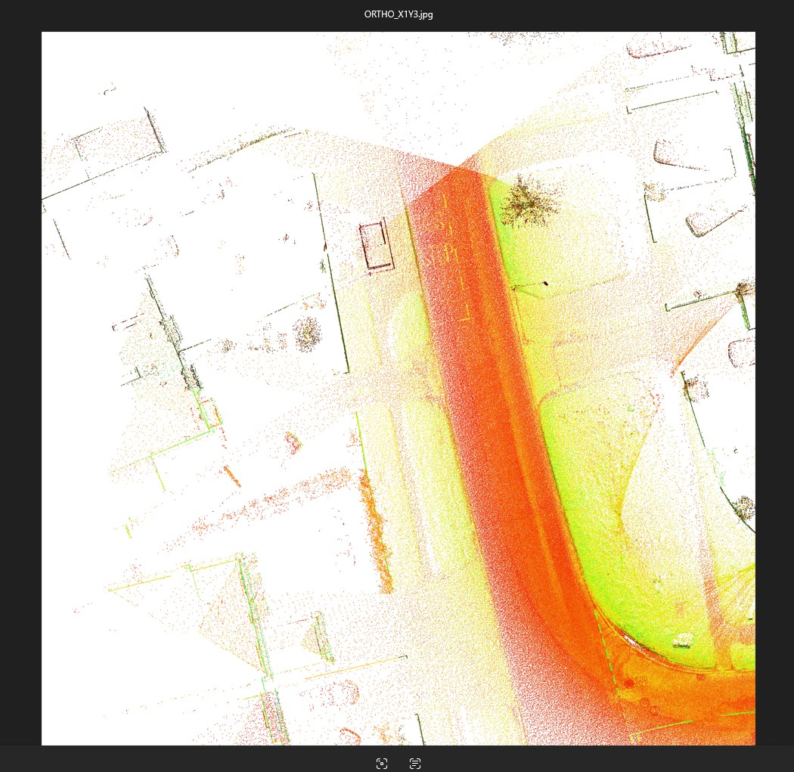
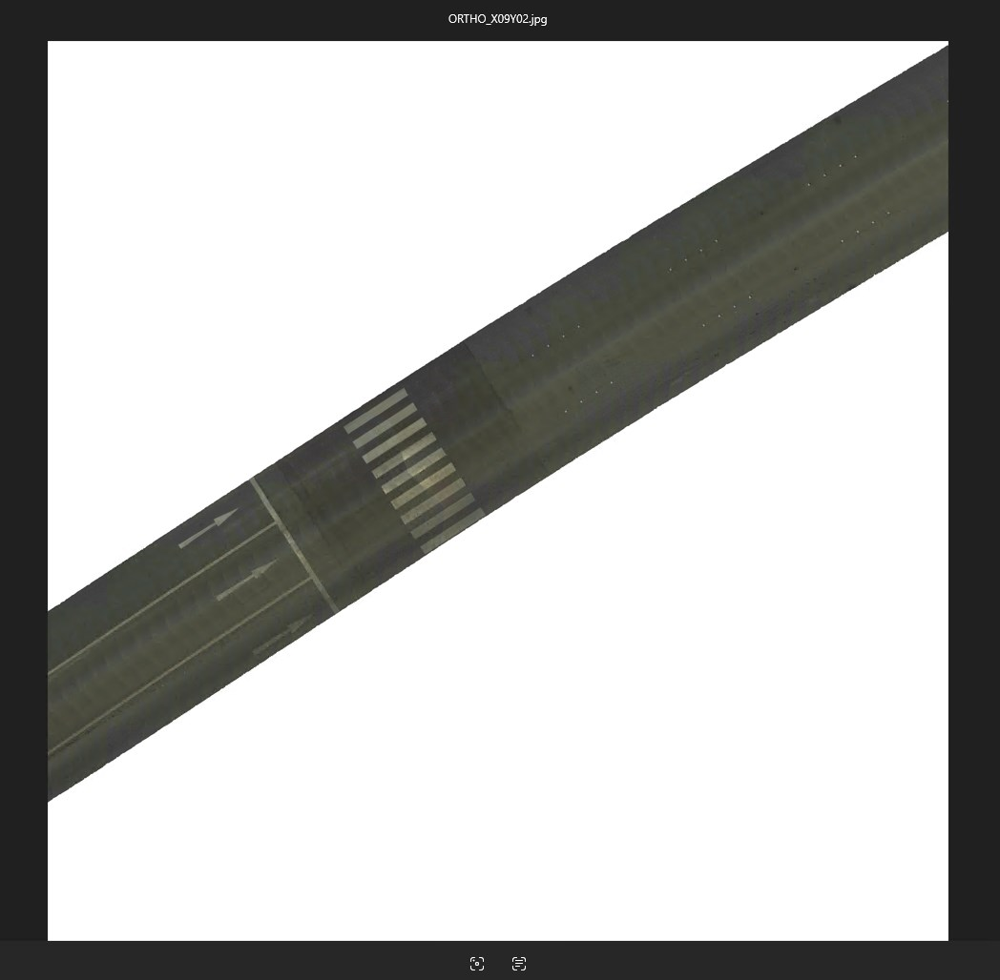

# Large Scale Orthographic image generation utility
 
| Script infos |  |
| -------- | ------- |
| Contact | Romain SALLENAVE |
| Email | romain.sallenave@rs-consul.com |
 
## Script description
This script provides a functionality to export top-down orthographic images from LGSx data. Both LIDAR and image based orthographic images are supported. Results are exported as .JPG data with geographic information (.JGW).
 
### Tested version
 
The following script has been tested on the following release versions:
- Cyclone 3DR 2025.1.2.47945 

## Details about the functionality
The script allows two types of processing: IMAGE based orthographic images and LIDAR based orthographic images.  
- **IMAGE based generation:** this feature only works with Pegasus TRK generated LGSx data (including point cloud data, image data and trajectory data altogether).   
- **LIDAR based generation:** this feature works with any kind of data, mobile mapping of TLS.   

For each type of processing manual and automatic mode.  
- **Automatic mode:** The script will automatically split the data in 50mx50m sections called 'tiles'. For each tile it will then generate the requested data according to user settings and export an orthographic image. Each orthographic image generated will include geographic information and include the name of the tile as suffix.    
- **Manual mode:** __*Can only be run after "Automatic mode" has been processed at least once!__  The script will only process the selected tiles. This allow the user to reprocess a specific part of the data with different settings, or focus on a specific area rather than the whole file.   

## How to use   
1. Run the script and select processing type ("IMAGE" or "LIDAR").  
2. If no Cloudworx data is already loaded in the project, the script will ask you to select the file (.LGSx) you want to open.   
3. Input user settings such as road width, triangle size, camera to use, image pixel size, etc... (settings vary depending on processing type)  
4. Set the file save location and file prefix*.   (*The generated orthoimages name will containt the selected prefix AND the tile name. You can rename the tiles to you preference if you need a specific naming.)  
5. Wait for the processing to finish. The files will be saved on the set location on your computer.  

## Result preview

## Sample data

You can download sample TRK and TLS dataset below :

- TRK Dataset (available soon)
- TLS Dataset (available soon)

