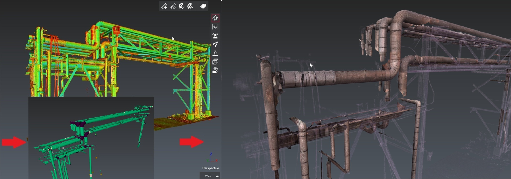

# Classification2Mesh

This script simplifies the process of generating a mesh from a classified point cloud. 

Follow the steps below:
1) Choose an already imported point cloud from your project.
2) Select a classification model and perform the classification. If the point cloud is already classified, you can skip this step.
3) After classification, it is possible to filter points corresponding to certain classes.
4) Use the Scan To Mesh algorithm to generate a mesh by selecting the appropriate scanner. Optionally, you can generate a texture for the mesh.
5) The resulting mesh can be exported in either OBJ or GLB format.

# Download Files

You can download individual file using these links (for text file, right click on the link and choose "Save as..."):

- [Classification2Mesh.js](./Classification2Mesh.js)
- [PipeMeshing.3dr](./PipeMeshing.3dr)